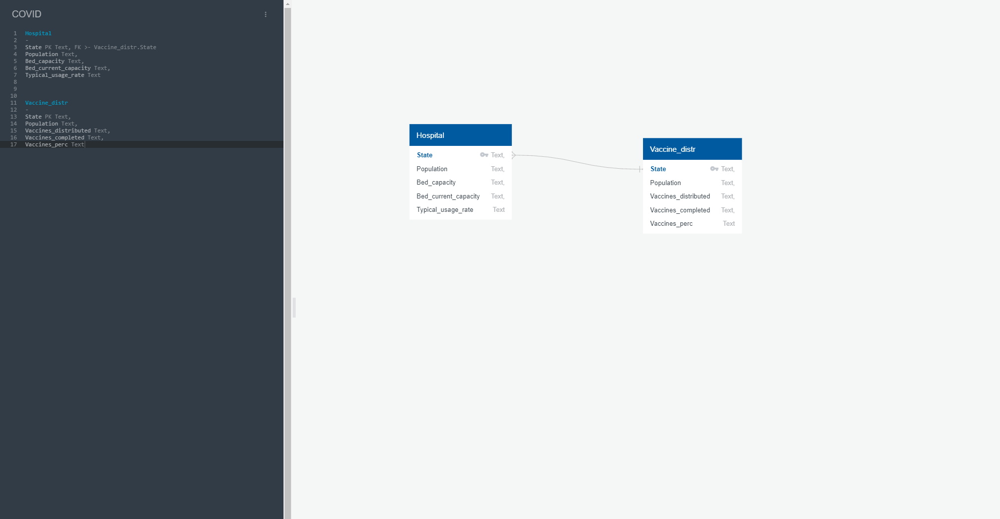

<h1 style="color:#87CEEB">Covid: Extract, Transform, Load</h1>

In this repository, our task was data integration. We extracted, transformed and loaded Covid-19 data into a database for storage.

<h2 style="color:#87CEEB">Extraction</h2>

We extracted two data sets from different sources. Our first data set from <a href="https://www.kaggle.com/iamsouravbanerjee/covid19-dataset-world-and-continent-wise?select=Covid+Data+-+World.csv" target="_blank" style="color:#DDA0DD">Kaggle</a> contained several CSVs with Covid data from across the world including total cases, deaths and recoveries. We chose to focus on North America for this process due to time constraints. 

Our second data set was sourced from <a href="https://covidactnow.org/?s=23261246" target="_blank" style="color:#DDA0DD">CovidActNow</a> which contains vaccination progress by states across the United States. We wanted to see how vaccination rates are effecting hospitalization rates. 

<h2 style="color:#87CEEB">Transformation</h2>

<h3 style="color:#FFFFFF">Kaggle:</h3>

* Removed several columns with unnecessary data

* Columns renamed

* Filtered out the three largest countries: USA, Canada & Mexico

<h3 style="color:#FFFFFF">CovidActNow:</h3>

* Loaded in a dataset of the effect of COVID in specific states

* Due to the amount of columns and information I had to choose the specific columns we wanted to focus on per state. 

* This included on table on the vaccine distributions per state as well as the hospital capacity per state.

<h2 style="color:#87CEEB">Load</h2>

<h3 style="color:#FFFFFF">Matthew's Loading Process: </h3>

* After cleaning the data In jupyter notebook and getting the tables the way I wanted I exported them into a CSV table.

* I then loaded this into SQLlite and got was able to extract the create table information to load into PGadmin.

* After creating the tables in PGadmin I created the ERD above. One thing I noticed was that the value of the columns all read "text" but still worked.

<h3 style="color:#FFFFFF">Darrell's Loading Process: </h3>

* 

* 

* 

<h2 style="color:#87CEEB">Conclusion</h2>
